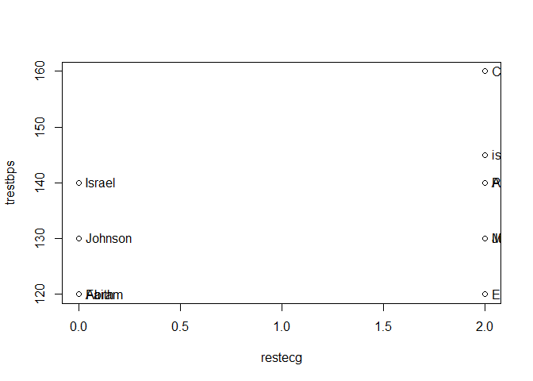
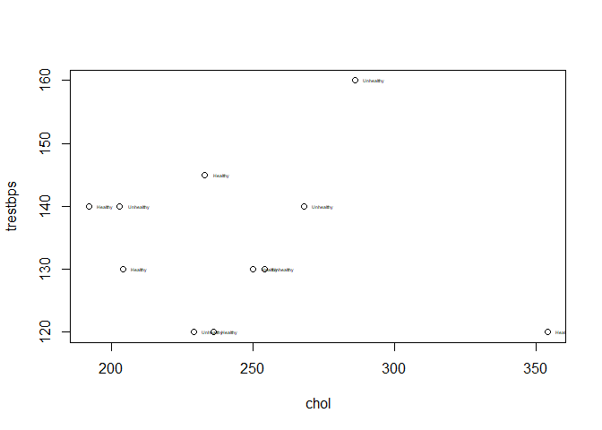
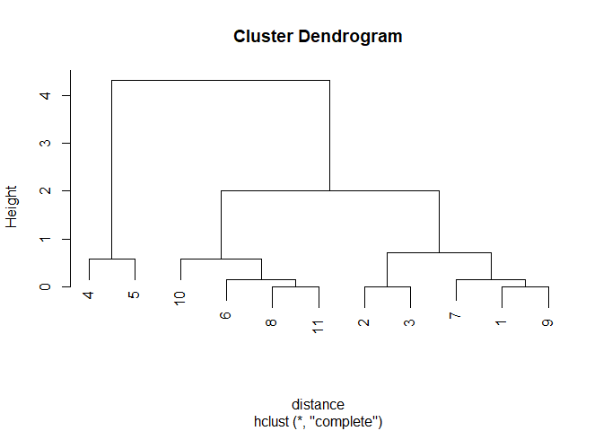
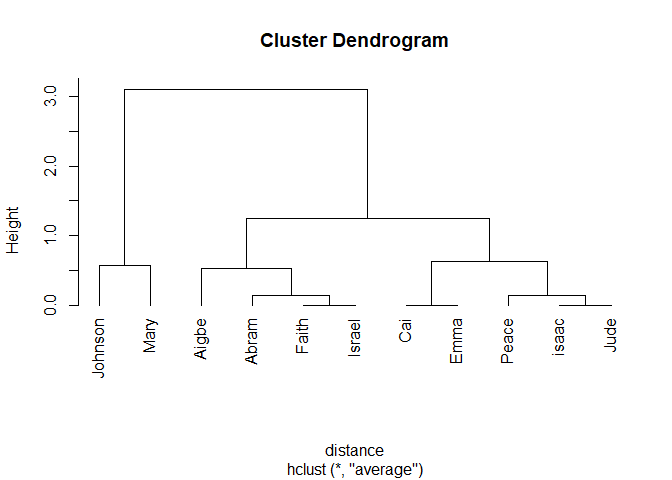
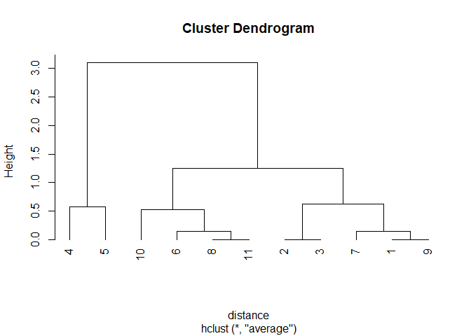

Hierarchical Clustering Machine learning
================
Joshua Edefo
2024-01-23

Library

``` r
library(readxl)
```

## R Markdown

This is an R Markdown document. Markdown is a simple formatting syntax
for authoring HTML, PDF, and MS Word documents. For more details on
using R Markdown see <http://rmarkdown.rstudio.com>.

Data loading and cleansing

``` r
clus <- read_excel("C:/Users/joe62/OneDrive - Aberystwyth University/Apps/Desktop/R code/clus.xlsx")
str(clus)
```

    ## tibble [11 × 15] (S3: tbl_df/tbl/data.frame)
    ##  $ age     : num [1:11] 63 67 67 37 41 56 62 57 63 53 ...
    ##  $ sex     : chr [1:11] "M" "M" "M" "M" ...
    ##  $ cp      : chr [1:11] "1" "4" "4" "3" ...
    ##  $ trestbps: num [1:11] 145 160 120 130 130 120 140 120 130 140 ...
    ##  $ chol    : num [1:11] 233 286 229 250 204 236 268 354 254 203 ...
    ##  $ fbs     : chr [1:11] "1" "0" "0" "0" ...
    ##  $ restecg : chr [1:11] "2" "2" "2" "0" ...
    ##  $ thalach : num [1:11] 150 108 129 187 172 178 160 163 147 155 ...
    ##  $ exang   : chr [1:11] "0" "1" "1" "0" ...
    ##  $ oldpeak : num [1:11] 2.3 1.5 2.6 3.5 1.4 0.8 3.6 0.6 1.4 3.1 ...
    ##  $ slope   : chr [1:11] "3" "2" "2" "3" ...
    ##  $ ca      : chr [1:11] "0" "3" "2" "0" ...
    ##  $ thal    : chr [1:11] "6" "3" "7" "3" ...
    ##  $ hd      : chr [1:11] "Healthy" "Unhealthy" "Unhealthy" "Healthy" ...
    ##  $ people  : chr [1:11] "isaac" "Cai" "Emma" "Johnson" ...

``` r
clus$people<-as.factor(clus$people)
str(clus)
```

    ## tibble [11 × 15] (S3: tbl_df/tbl/data.frame)
    ##  $ age     : num [1:11] 63 67 67 37 41 56 62 57 63 53 ...
    ##  $ sex     : chr [1:11] "M" "M" "M" "M" ...
    ##  $ cp      : chr [1:11] "1" "4" "4" "3" ...
    ##  $ trestbps: num [1:11] 145 160 120 130 130 120 140 120 130 140 ...
    ##  $ chol    : num [1:11] 233 286 229 250 204 236 268 354 254 203 ...
    ##  $ fbs     : chr [1:11] "1" "0" "0" "0" ...
    ##  $ restecg : chr [1:11] "2" "2" "2" "0" ...
    ##  $ thalach : num [1:11] 150 108 129 187 172 178 160 163 147 155 ...
    ##  $ exang   : chr [1:11] "0" "1" "1" "0" ...
    ##  $ oldpeak : num [1:11] 2.3 1.5 2.6 3.5 1.4 0.8 3.6 0.6 1.4 3.1 ...
    ##  $ slope   : chr [1:11] "3" "2" "2" "3" ...
    ##  $ ca      : chr [1:11] "0" "3" "2" "0" ...
    ##  $ thal    : chr [1:11] "6" "3" "7" "3" ...
    ##  $ hd      : chr [1:11] "Healthy" "Unhealthy" "Unhealthy" "Healthy" ...
    ##  $ people  : Factor w/ 11 levels "Abram","Aigbe",..: 6 3 4 8 10 1 11 5 9 2 ...

``` r
head(clus)
```

    ## # A tibble: 6 × 15
    ##     age sex   cp    trestbps  chol fbs   restecg thalach exang oldpeak slope
    ##   <dbl> <chr> <chr>    <dbl> <dbl> <chr> <chr>     <dbl> <chr>   <dbl> <chr>
    ## 1    63 M     1          145   233 1     2           150 0         2.3 3    
    ## 2    67 M     4          160   286 0     2           108 1         1.5 2    
    ## 3    67 M     4          120   229 0     2           129 1         2.6 2    
    ## 4    37 M     3          130   250 0     0           187 0         3.5 3    
    ## 5    41 F     2          130   204 0     2           172 0         1.4 1    
    ## 6    56 M     2          120   236 0     0           178 0         0.8 1    
    ## # ℹ 4 more variables: ca <chr>, thal <chr>, hd <chr>, people <fct>

# Scatter plots and Normalization of data

``` r
# scatter plot

plot(trestbps~restecg, clus)
with(clus, text(trestbps~restecg, labels = people, pos = 4, cex=1))
```

<!-- -->

``` r
plot (trestbps~chol, clus)
with(clus, text(trestbps~chol, labels= hd, pos=4, cex=0.3))
```

<!-- -->

``` r
# normalisation of the data

z <- clus[, c(1,1)]
m<- apply(z, 2, mean)
s<- apply(z, 2, sd)
z<- scale(z,m, s)
```

Clustering formation

``` r
# calculate the Euclidean distance
distance<-dist(z)

print (distance, digits=1)
```

    ##      1   2   3   4   5   6   7   8   9  10
    ## 2  0.6                                    
    ## 3  0.6 0.0                                
    ## 4  3.7 4.3 4.3                            
    ## 5  3.2 3.7 3.7 0.6                        
    ## 6  1.0 1.6 1.6 2.7 2.2                    
    ## 7  0.1 0.7 0.7 3.6 3.0 0.9                
    ## 8  0.9 1.4 1.4 2.9 2.3 0.1 0.7            
    ## 9  0.0 0.6 0.6 3.7 3.2 1.0 0.1 0.9        
    ## 10 1.4 2.0 2.0 2.3 1.7 0.4 1.3 0.6 1.4    
    ## 11 0.9 1.4 1.4 2.9 2.3 0.1 0.7 0.0 0.9 0.6

``` r
# clustering dindrogram

# hierarchical clustering
hc.l <- hclust(distance)
plot(hc.l)
```

<!-- -->

``` r
plot(hc.l, labels=clus$people, hang=-1)
```

<!-- -->

``` r
# clustering Dendogram average
hc.l <- hclust(distance, method = "average")

plot(hc.l, labels=clus$people, hang=-1)
```

<!-- -->

``` r
plot(hc.l, hang=-1)
```

<!-- -->

``` r
# clustering membership
membership_1<- cutree(hc.l,2)
aggregate(z,list(membership_1), mean)
```

    ##   Group.1        age        age
    ## 1       1  0.3982323  0.3982323
    ## 2       2 -1.7920455 -1.7920455

``` r
#actual values
aggregate(clus[, -c(1,1)], list(membership_1), mean)
```

    ## Warning in mean.default(X[[i]], ...): argument is not numeric or logical:
    ## returning NA

    ## Warning in mean.default(X[[i]], ...): argument is not numeric or logical:
    ## returning NA

    ## Warning in mean.default(X[[i]], ...): argument is not numeric or logical:
    ## returning NA

    ## Warning in mean.default(X[[i]], ...): argument is not numeric or logical:
    ## returning NA

    ## Warning in mean.default(X[[i]], ...): argument is not numeric or logical:
    ## returning NA

    ## Warning in mean.default(X[[i]], ...): argument is not numeric or logical:
    ## returning NA

    ## Warning in mean.default(X[[i]], ...): argument is not numeric or logical:
    ## returning NA

    ## Warning in mean.default(X[[i]], ...): argument is not numeric or logical:
    ## returning NA

    ## Warning in mean.default(X[[i]], ...): argument is not numeric or logical:
    ## returning NA

    ## Warning in mean.default(X[[i]], ...): argument is not numeric or logical:
    ## returning NA

    ## Warning in mean.default(X[[i]], ...): argument is not numeric or logical:
    ## returning NA

    ## Warning in mean.default(X[[i]], ...): argument is not numeric or logical:
    ## returning NA

    ## Warning in mean.default(X[[i]], ...): argument is not numeric or logical:
    ## returning NA

    ## Warning in mean.default(X[[i]], ...): argument is not numeric or logical:
    ## returning NA

    ## Warning in mean.default(X[[i]], ...): argument is not numeric or logical:
    ## returning NA

    ## Warning in mean.default(X[[i]], ...): argument is not numeric or logical:
    ## returning NA

    ## Warning in mean.default(X[[i]], ...): argument is not numeric or logical:
    ## returning NA

    ## Warning in mean.default(X[[i]], ...): argument is not numeric or logical:
    ## returning NA

    ## Warning in mean.default(X[[i]], ...): argument is not numeric or logical:
    ## returning NA

    ## Warning in mean.default(X[[i]], ...): argument is not numeric or logical:
    ## returning NA

    ##   Group.1 sex cp trestbps     chol fbs restecg  thalach exang  oldpeak slope ca
    ## 1       1  NA NA      135 250.5556  NA      NA 148.6667    NA 1.811111    NA NA
    ## 2       2  NA NA      130 227.0000  NA      NA 179.5000    NA 2.450000    NA NA
    ##   thal hd people
    ## 1   NA NA     NA
    ## 2   NA NA     NA

Session Information

``` r
sessionInfo()
```

    ## R version 4.3.1 (2023-06-16 ucrt)
    ## Platform: x86_64-w64-mingw32/x64 (64-bit)
    ## Running under: Windows 11 x64 (build 22631)
    ## 
    ## Matrix products: default
    ## 
    ## 
    ## locale:
    ## [1] LC_COLLATE=English_United Kingdom.utf8 
    ## [2] LC_CTYPE=English_United Kingdom.utf8   
    ## [3] LC_MONETARY=English_United Kingdom.utf8
    ## [4] LC_NUMERIC=C                           
    ## [5] LC_TIME=English_United Kingdom.utf8    
    ## 
    ## time zone: Europe/London
    ## tzcode source: internal
    ## 
    ## attached base packages:
    ## [1] stats     graphics  grDevices utils     datasets  methods   base     
    ## 
    ## other attached packages:
    ## [1] readxl_1.4.3
    ## 
    ## loaded via a namespace (and not attached):
    ##  [1] digest_0.6.33     utf8_1.2.3        fastmap_1.1.1     xfun_0.40        
    ##  [5] cellranger_1.1.0  magrittr_2.0.3    glue_1.6.2        tibble_3.2.1     
    ##  [9] knitr_1.44        pkgconfig_2.0.3   htmltools_0.5.6   rmarkdown_2.25   
    ## [13] lifecycle_1.0.3   cli_3.6.1         fansi_1.0.4       vctrs_0.6.3      
    ## [17] compiler_4.3.1    rstudioapi_0.15.0 tools_4.3.1       pillar_1.9.0     
    ## [21] evaluate_0.21     yaml_2.3.7        rlang_1.1.1
